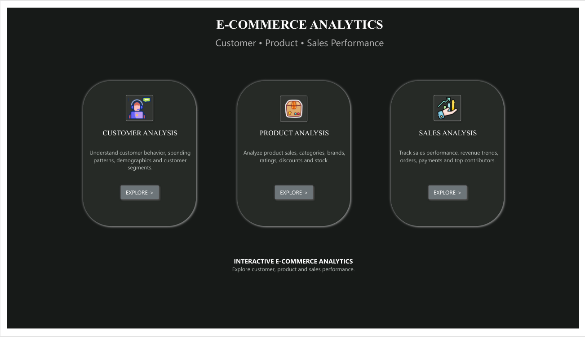
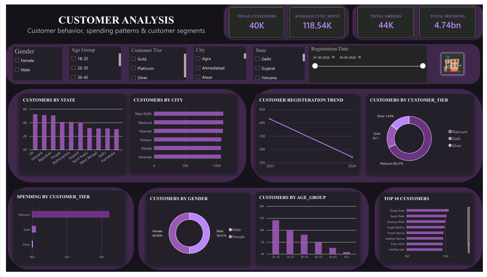
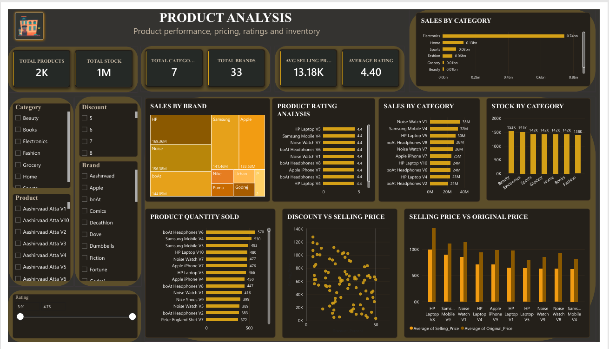
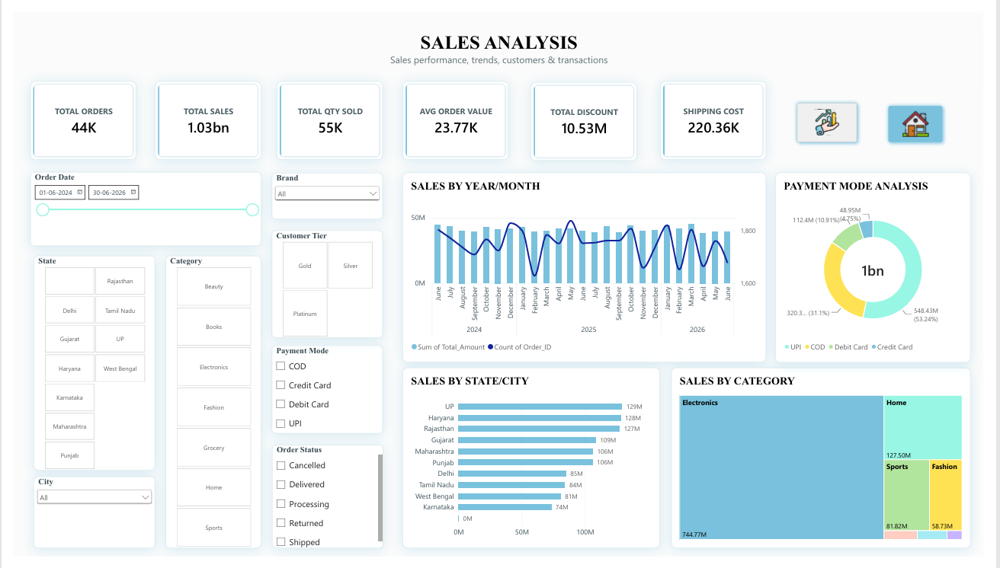
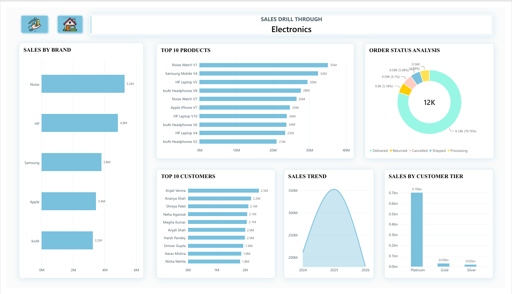

# 📊 E-Commerce Sales, Product & Customer Analytics Dashboard

An interactive **Power BI dashboard** analyzing e-commerce sales, customer behavior, product performance, and overall business trends.

---

## 📌 Project Overview

This project transforms e-commerce data into an interactive Power BI dashboard covering:

- Customer behavior and spending
- Customer segmentation
- Product and category performance
- Brand performance
- Sales trends
- Regional sales and customer distribution
- Payment methods
- Order-status distribution
- Inventory and product performance

The dashboard includes **Home, Customer Analysis, Product Analysis, Sales Analysis, and Category-based Sales Drill-Through** pages.

---

## 🎯 Business Objective

The objective of this project is to analyze e-commerce data and identify key business patterns related to:

- Customer spending and segmentation
- Product and category performance
- Sales trends over time
- Regional sales and customer distribution
- Payment-method usage
- Order-status performance
- Inventory and product performance

---

## 🛠️ Tools & Technologies

- **Power BI**
- **Power Query**
- **DAX**
- **Data Modeling**
- **Data Visualization**

---

## 📊 Dashboard Pages

### 🏠 Home

Provides an overview of the dashboard and navigation to the main analytical sections:

- Customer Analysis
- Product Analysis
- Sales Analysis

### 👥 Customer Analysis

Analyzes customer demographics, spending behavior, customer tiers, and customer distribution.

Key areas include:

- Customer Tier
- Age Group
- Customer Spending
- Customer Count
- State-wise Customers
- Top-Spending Customers
- Customer Segmentation

### 📦 Product Analysis

Analyzes product and inventory performance.

Key areas include:

- Sales by Category
- Sales by Brand
- Top-Selling Products
- Product Ratings
- Discount Analysis
- Stock Levels
- Selling Price
- Quantity Sold

### 💰 Sales Analysis

Provides an overview of overall sales performance.

Key areas include:

- Total Sales
- Total Orders
- Total Quantity
- Average Order Value
- Shipping Cost
- Sales Trend
- Sales by State
- Sales by City
- Sales by Category
- Payment Mode
- Order Status
- Customer Tier

### 🔎 Sales Drill-Through by Category

The Sales Drill-Through page provides detailed analysis for a selected **product category**.

Key areas include:

- Sales by Brand
- Top 10 Products
- Top 10 Customers
- Order Status
- Sales Trend
- Customer Tier Sales

This allows users to move from the overall sales view into detailed category-level analysis.

---

## 📈 Key KPIs

The dashboard tracks important business metrics including:

- Total Sales
- Total Orders
- Total Customers
- Total Quantity Sold
- Average Order Value
- Total Discount
- Total Shipping Cost
- Total Products
- Total Stock
- Total Categories
- Total Brands
- Average Selling Price
- Average Rating

---

## 🔄 Data Analytics Workflow

```text
Raw Data
   ↓
Data Cleaning
   ↓
Data Transformation
   ↓
Data Modeling
   ↓
DAX Measures
   ↓
Interactive Dashboard
   ↓
Business Insights
```

---

## 🧹 Data Preparation

Data preparation was performed using **Power Query**, including:

- Data cleaning
- Handling missing values
- Correcting data types
- Column transformation
- Creating required fields
- Preparing data for analysis

---

## 🧮 DAX & Data Modeling

**DAX** was used to create calculated measures and KPIs for sales, customers, products, orders, and other business metrics.

Data modeling was used to establish relationships between relevant tables and enable interactive filtering and drill-through analysis.

---

# 🔍 Key Business Insights

## 👥 Customer Insights

- **Platinum** has the highest customer base and total spending.
- **26–35** is the largest age group within both the **Platinum and Gold tiers**.
- Within the **Silver tier, 18–25** has the highest customer count, followed by **46–55**.
- The strong representation of the **26–35 age group in Platinum** indicates that this age group is an important segment among high-value customers.
- **Uttar Pradesh** has the strongest customer presence for both **Platinum and Gold**, although Gold has a smaller customer base than Platinum.
- **Haryana** has the highest customer presence within the **Silver tier**, showing that customer distribution varies across states and customer tiers.
- **Pooja Shah** is the highest-spending customer.

### Customer Segment Focus

> **The company should focus on Gold and Silver customers while continuing to retain its strong Platinum customer base.** The **26–35 age group** has the highest customer count in both Platinum and Gold, while **18–25** leads in Silver, followed by **46–55**. Uttar Pradesh has the strongest customer presence for Platinum and Gold, whereas Haryana leads within Silver. These differences across age groups, states, and customer tiers provide opportunities to develop targeted offers, loyalty benefits, and personalized recommendations while encouraging customers to progress toward higher-value tiers.

---

## 📦 Product Insights

- **Electronics** is the highest-sales category.
- **HP** is the best-performing brand.
- **Boat Headphones V6** is the best-selling product.
- **HP Laptop V5** has the highest rating.
- Products with **low stock and strong sales** should be prioritized for restocking.
- Products with **high stock but comparatively low sales** should be reviewed for pricing, promotions, or product positioning.

---

## 💰 Sales Insights

- **May 2025** recorded the highest sales.
- **Uttar Pradesh** generated the highest revenue.
- **UPI** is the most-used payment mode.
- **79.76%** of orders were Delivered.
- **5.18%** of orders were Returned.
- **5.10%** of orders were Cancelled.
- **5.08%** of orders were Shipped.
- **4.80%** of orders were Processing.
- **2025, Electronics, and Platinum** are the key sales-driving dimensions.

---

## 💡 Business Opportunities

- Develop **Gold-to-Platinum upgrade strategies** to increase customer value.
- Target **18–25 Silver customers** with personalized engagement and loyalty initiatives.
- Use **state- and tier-specific customer strategies** based on the different geographic patterns observed across Platinum, Gold, and Silver customers.
- Prioritize **high-demand, low-stock products** for restocking.
- Review **high-stock, low-sales products** to improve product performance.
- Monitor **returns and cancellations** to identify potential operational issues.
- Use customer and product segmentation to support targeted business decisions.

---

## 📸 Dashboard Preview

### 🏠 Home



### 👥 Customer Analysis



### 📦 Product Analysis



### 💰 Sales Analysis



### 🔎 Sales Drill-Through



---

## 🎥 Power BI Dashboard Demo

A walkthrough video demonstrating the interactive dashboard, navigation, filtering, and category-based drill-through functionality.

**▶️ [Watch the Power BI Dashboard Demo](./PowerBI_Dashboard_Demo.mp4)**

---

## 📂 Project Structure

```text
Ecommerce-Sales-Customer-Analytics-PowerBI/
│
├── README.md
│
├── PowerBI/
│   └── Ecommerce_Sales_Customer_Analytics.pbix
│
├── screenshots/
│   ├── home.png
│   ├── customer-analysis.png
│   ├── product-analysis.png
│   ├── sales-analysis.png
│   └── sales-drill-through-analysis.png
│
└── PowerBI_Dashboard_Demo.mp4
```

---

## 🚀 How to Use

1. Download the `.pbix` file.
2. Open it using **Microsoft Power BI Desktop**.
3. Navigate through the dashboard pages.
4. Use the available filters and interactive visuals to explore the data.
5. Select a category and use **Sales Drill-Through** to explore detailed category-level performance.

---

## 💼 Skills Demonstrated

- Power BI
- Power Query
- DAX
- Data Cleaning
- Data Transformation
- Data Modeling
- Data Visualization
- KPI Development
- Customer Segmentation
- Sales Analysis
- Product Analysis
- Inventory Analysis
- Business Intelligence
- Interactive Dashboard Development
- Drill-Through Analysis
- Business Insights

---

## 👩‍💻 Author

**Sravani Thammineni**

Aspiring Data Analyst | Power BI | SQL | Python | Excel
